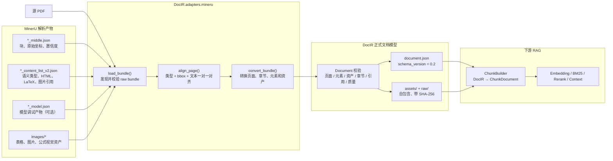
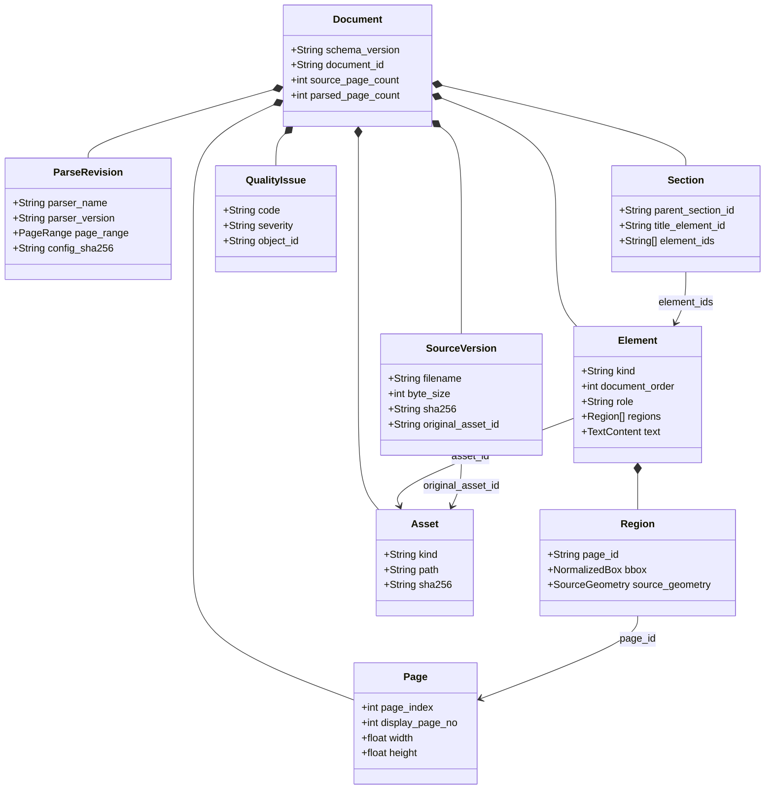

# DocIR

DocIR 是解析器无关的文档中间表示。它把 MinerU 等解析器产生的原始结果整理为一个可校验、可追踪、可被下游 RAG 稳定消费的文档快照。

当前唯一正式线格式为 `schema_version="0.2"`。DocIR 保存文档结构、文字来源、页面坐标、视觉资产和质量问题；它不保存 Chunk、Embedding、BM25 或向量索引。

## 1. 架构

### 1.1 从 PDF 到 RAG 的位置



DocIR 位于“解析器输出”和“检索分块”之间：

- 向上隔离 MinerU 的具体 JSON 结构和版本差异。
- 向下提供稳定的页面、章节、元素、坐标、资产与质量契约。
- 下游只消费已通过 DocIR 全局校验的快照，不直接依赖 MinerU 文件。

### 1.2 DocIR 内部对象关系



关键关系：

- `Page` 表示源文件的物理页面。
- `Section` 表示逻辑章节树，引用其中的 `Element`。
- `Element` 是全局有序的内容单元，可以跨多个页面 Region；跨页表格就是一个 `TableElement` 对应多个 `Region`。
- `Asset` 保存原文件、MinerU raw JSON 和视觉文件的相对路径、大小与 SHA-256。
- `QualityIssue` 记录不确定性和降级，不把问题悄悄抹掉。

## 2. DocIR 输出是什么

DocIR 的核心输出不是一段拼接文本，而是一个自包含目录。批处理默认产生：

```text
artifacts/docir/runs/<run_id>/<document_directory>/
├── document.json              # 正式 DocIR 快照，下游主要入口
├── assets/
│   ├── <source.pdf>           # 原始文件
│   └── visual/                # 表格、图片、公式等视觉资产
│       └── <hash>--<name>.*
├── raw/
│   ├── *_middle.json          # 构建该快照使用的 MinerU 原始结构
│   ├── *_content_list_v2.json
│   └── *_model.json           # 若 MinerU 生成该文件
├── result.json                # 单文档执行状态和机器统计
├── preview.md                 # 便于人工快速检查的文本预览
└── mineru.log                 # MinerU 执行日志
```

其中只有 `document.json` 是正式 DocIR 数据模型；`result.json`、`preview.md` 和 `mineru.log` 属于批处理运行记录。`assets/` 与 `raw/` 由 `document.json` 中的 Asset 引用，使结果可以独立校验和迁移。

### 2.1 `document.json` 顶层结构

| 字段 | 含义 |
| --- | --- |
| `schema_name` / `schema_version` | 固定为 `docir` / `0.2` |
| `document_id` | 基于源文件身份生成的稳定文档 ID |
| `source` | 原文件名、媒体类型、大小、SHA-256 和原文件 Asset |
| `parse_revision` | 解析器版本、后端、页范围、配置和 raw 产物引用 |
| `pages` | 源 PDF 的物理页面信息，保留原始 0-based `page_index` |
| `sections` | 单根逻辑章节树及其元素引用 |
| `elements` | 全局有序的判别联合内容元素 |
| `assets` | 原文件、raw JSON、页面图像和视觉资产清单 |
| `quality_issues` | 对齐、文字来源或资产问题等可追踪告警 |
| `validation` | 快照的最终校验状态及问题 ID |

结构可以简化理解为：

```text
Document
├── source
├── parse_revision
├── pages[]
├── sections[]
├── elements[]
│   ├── regions[] ────────────────> pages[].page_id
│   ├── text.layers[]
│   ├── section_id ───────────────> sections[].section_id
│   ├── asset_id（部分元素）──────> assets[].asset_id
│   └── quality_issue_ids[] ──────> quality_issues[].issue_id
├── assets[]
├── quality_issues[]
└── validation
```

### 2.2 元素输出

`elements` 使用 `kind` 作为判别字段。正式类型包括：

| `kind` | 主要专有字段 | 用途 |
| --- | --- | --- |
| `heading` | `level` | 标题与章节入口 |
| `paragraph` | — | 普通段落、页眉、页码等文字块 |
| `list` | `ordered`, `items` | 有序或无序列表 |
| `table` | `html`, `asset_id` | 表格结构及视觉文件 |
| `formula` | `latex`, `asset_id` | 公式语义及视觉文件 |
| `figure` | `asset_id` | 图片和图表 |
| `code` | `language` | 代码或算法块 |
| `unknown` | `raw_type`, `raw_payload` | 宽松模式下保留尚未支持的解析器类型 |

每个元素还有以下公共信息：

- `document_order`：从 0 连续递增的全文阅读顺序。
- `role`：`body`、`header`、`footer`、`page_number`、`caption` 等页面角色。
- `section_id`：所属逻辑章节。
- `regions`：元素在一个或多个物理页面上的位置。
- `text`：一个或多个文字层，以及主文字层、来源、置信度和逐字引用资格。
- `quality_issue_ids`：与该元素相关的问题引用。

### 2.3 精简输出示例

下面是为了说明关系而删减过的字段示意，不是可直接加载的完整 DocIR；完整、可校验的样例见 `examples/v0_2/mineru_text_page/document.json`。

```json
{
  "schema_name": "docir",
  "schema_version": "0.2",
  "document_id": "doc_3e9c5755b430c0394c3afee7",
  "source": {
    "filename": "source.pdf",
    "media_type": "application/pdf",
    "byte_size": 895277,
    "sha256": "18d2413...",
    "original_asset_id": "asset_original"
  },
  "parse_revision": {
    "parser_name": "MinerU",
    "parser_version": "3.4.4",
    "backend": "pipeline",
    "page_range": {"start": 0, "end": 0},
    "config_sha256": "fc8be6c...",
    "raw_artifact_ids": ["asset_middle", "asset_content_v2"]
  },
  "pages": [
    {
      "page_id": "page_000000",
      "page_index": 0,
      "display_page_no": 1,
      "width": 595.0,
      "height": 842.0,
      "unit": "pt"
    }
  ],
  "sections": [
    {
      "section_id": "section_root",
      "parent_section_id": null,
      "title_element_id": null,
      "element_ids": []
    },
    {
      "section_id": "section_intro",
      "parent_section_id": "section_root",
      "title_element_id": "element_title",
      "element_ids": ["element_title"]
    }
  ],
  "elements": [
    {
      "element_id": "element_title",
      "kind": "heading",
      "level": 1,
      "document_order": 0,
      "role": "body",
      "section_id": "section_intro",
      "regions": [
        {
          "region_id": "region_title",
          "page_id": "page_000000",
          "bbox": {"x0": 0.08, "y0": 0.07, "x1": 0.81, "y1": 0.10},
          "source_geometry": {
            "coordinate_space": "mineru_middle_page",
            "bbox": [49.0, 57.0, 480.0, 83.0],
            "page_width": 595.0,
            "page_height": 842.0
          }
        }
      ],
      "text": {
        "primary_layer_id": "text_element_title",
        "layers": [
          {
            "text_layer_id": "text_element_title",
            "origin": "native_or_ocr_unverified",
            "text": "示例文档标题",
            "confidence": 0.95,
            "quote_eligible": false,
            "spans": []
          }
        ]
      },
      "quality_issue_ids": ["issue_text_origin"]
    }
  ],
  "assets": [
    {
      "asset_id": "asset_original",
      "kind": "original",
      "path": "assets/source.pdf",
      "media_type": "application/pdf",
      "byte_size": 895277,
      "sha256": "18d2413..."
    }
  ],
  "quality_issues": [
    {
      "issue_id": "issue_text_origin",
      "code": "text_origin_unverified",
      "severity": "warning",
      "message": "MinerU raw 产物未证明文字来自 native text 还是 OCR",
      "object_id": "element_title"
    }
  ],
  "validation": {
    "status": "passed_with_warnings",
    "issue_ids": ["issue_text_origin"]
  }
}
```

### 2.4 坐标、文字与资产约定

坐标：

- `Page.page_index` 永远是源文件中的 0-based 页索引。
- `display_page_no` 等于 `page_index + 1`。
- `Region.bbox` 使用 `[0, 1]` 规范坐标，便于跨分辨率处理。
- `Region.source_geometry` 保留 MinerU 原始坐标及页面尺寸，便于回溯。

文字：

- `TextContent.primary_layer_id` 指向当前首选文字层。
- 每个 `TextLayer` 明确 `origin`、`confidence` 和 `quote_eligible`。
- MinerU 无法证明 native/OCR 来源时使用 `native_or_ocr_unverified`，并设置 `quote_eligible=false`；下游应按 OCR 风险处理。

资产：

- 所有 `Asset.path` 都是安全的相对 POSIX 路径。
- 每个资产保存 `byte_size` 和完整 SHA-256。
- `TableElement`、`FormulaElement`、`FigureElement` 可以通过 `asset_id` 直接关联视觉文件。
- `SourceVersion.original_asset_id` 指向原始输入文件。
- `ParseRevision.raw_artifact_ids` 指向构建该快照使用的 MinerU JSON。

## 3. 最小使用方式

以下命令和相对路径均以 ESA 仓库根目录为起点。

```python
from pathlib import Path

from backend.agent.DocIR import load_document

document = load_document(Path("artifacts/docir/runs/<run_id>/<document>/document.json"))

for element in document.elements:
    print(element.document_order, element.kind, element.role)
```

对整个 PDF 目录执行 MinerU → DocIR：

```bash
python -m backend.agent.DocIR.tools.batch_corpus --run-id <run_id> --resume
```

运行 DocIR、Chunk 和 RAG 回归：

```bash
python -m pytest backend/agent/DocIR/tests backend/agent/rag/chunk/tests
```

## 4. 证明边界

- DocIR 能证明快照内部引用、顺序、坐标、哈希和资产关系满足当前模型约束。
- DocIR 记录解析器给出的文字和结构，但不自动证明解析内容在语义上正确。
- 视觉资产被保存和关联，不代表已经经过 VLM 理解。
- 已支持类型来自当前 MinerU 3.4.4 实测语料；宽松模式用 `UnknownElement` 保留新类型，严格模式会报错。
