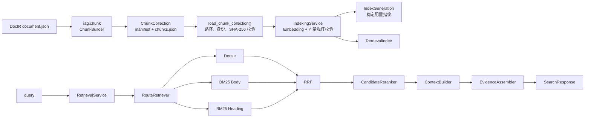

# RAG 模块

本模块消费正式 `rag.chunk.ChunkCollection`，负责索引构建、混合召回、排名融合、候选重排、章节上下文和结构化证据输出。DocIR 只描述文档事实；Chunk 子模块只生成检索内容单元；查询链不会反向修改二者。

当前真实基线为 7 份文档、532 个 Chunk、2165 条可回查 Evidence。确定性后端用于验证数据流和回归，不代表真实语义模型或 Qdrant 已经完成部署。

## 1. 架构



索引构建与在线查询是两个独立阶段：

1. `IndexingService.build()` 先计算完整 `IndexGeneration`，再检查后端是否已有同代次、同数量的 Point；进程重启后重复执行也不会再次编码或写入。
2. `RetrievalService.search()` 只查询已经准备好的索引，不包含隐式建库行为。

`IndexGeneration` 绑定以下关键输入：

- ChunkCollection ID 与 manifest SHA-256；
- Embedding 后端配置指纹；
- 索引后端配置指纹；
- Dense 向量维度；
- Chunk 数量。

## 2. 模块职责

```text
backend/agent/rag/
├── chunk/                  # DocIR → ChunkCollection
│   ├── models.py           # Chunk 与 Collection 契约
│   ├── text.py             # 保留原文偏移的文本切分
│   ├── table.py            # HTML 表格解析与行组切分
│   ├── fragments.py        # Element → Fragment + Evidence
│   ├── builder.py          # 章节分组与 Chunk 组装
│   ├── serializer.py       # 确定性、原子 JSON 读写
│   └── cli.py              # 批量构建入口
├── collection.py           # Collection 严格加载
├── config.py               # ESA RAG 集中运行配置
├── indexing/
│   ├── service.py          # 索引构建与 IndexGeneration
│   └── deployment.py       # 可重启部署 manifest 契约
├── indexes/
│   ├── reference.py        # 无外部依赖的确定性参考索引
│   └── qdrant.py           # Qdrant 三命名向量适配器
├── inference/
│   ├── reference.py        # 确定性 Embedding 与 Reranker
│   ├── http.py             # vLLM HTTP 后端
│   ├── transformers.py     # Transformers 本地后端
│   └── sentence_transformers.py
├── retrieval/
│   ├── contracts.py        # 查询协议与稳定输出契约
│   ├── routing.py          # 三路召回与 Dense 降级
│   ├── fusion.py           # RRF 与 overlap 合并
│   ├── reranking.py        # 重排、阈值和候选去重
│   ├── context.py          # 章节上下文与 Evidence 组装
│   └── service.py          # 只负责查询编排
├── evaluation/
│   ├── metrics.py          # 通用分层指标
│   ├── reference.py        # 真实语料确定性评测
│   ├── benchmark.py        # 通用性能采样
│   └── real_models.py      # 真实模型基准入口
├── agent_api.py            # ESA ToolRegistry 的只读适配接口
└── cli/
    └── index.py            # Qdrant 构建、校验、查询入口
```

依赖方向固定为：

```text
DocIR ← rag.chunk ← collection ← indexing/retrieval ← evaluation/cli
```

`rag.chunk` 不导入索引、推理或查询模块；索引和推理后端通过协议注入查询链。

## 3. 输出

### 3.1 在线查询输出

`RetrievalService.search()` 返回 `SearchResponse`：

```text
SearchResponse
├── query
├── context_level          # evidence / section / full_read
├── hits[]
│   ├── chunk_id
│   ├── rrf_score
│   ├── rerank_score       # 未启用或降级时为 null
│   ├── context_chunk_ids[]
│   ├── context_text
│   └── evidence[]
│       ├── evidence_id / element_id / chunk_id
│       ├── evidence_text
│       ├── text_origin / quote_eligible / derivation
│       ├── document_id / source_version_id / parse_revision_id
│       ├── section_path[]
│       ├── locators[]        # 可选；page、group 或其他来源定位
│       ├── asset_ids[]
│       └── quality_issue_ids[]
└── trace
    ├── rankings
    │   ├── dense
    │   ├── bm25_body
    │   ├── bm25_heading
    │   ├── rrf
    │   └── reranker
    └── degraded[]
```

`evidence_text` 与 `context_text` 的语义不同：前者来自不可变 Evidence 映射，用于回查；后者是受章节边界限制的上下文拼接，不能自动视为逐字引用。

Agent 工具适配层会在不修改 Evidence 的前提下，对 `results[].content` 和顶层
`context_text` 做确定性摘录：所有结果合计不超过 2048 个估算 token，单条不超过
512 个估算 token；被裁剪的内容以 `…` 标记。检索服务自身的上下文预算仍由
`RAG_MAX_CONTEXT_TOKENS` 控制。

当前真实 Evidence 的来源均为 `native_or_ocr_unverified`，因此 `quote_eligible=false`。上层只能表述为“解析或 OCR 风险文字”，不能声称已证明为 PDF 原生文字。

### 3.2 ChunkCollection 输出

```text
artifacts/chunk/collections/<collection_id>/
├── manifest.json
├── stats.json
└── documents/
    └── <document_directory>/
        └── chunks.json
```

相同 DocIR 输入和 ChunkConfig 重复构建必须得到相同 Collection ID、Chunk ID 与文件内容。

### 3.3 参考评测输出

```text
artifacts/rag/evaluations/<evaluation_id>/
├── manifest.json          # IndexGeneration、配置指纹和输入哈希
├── results.json           # 42 条问题的逐层排名与最终命中
├── summary.json           # Recall@20、Hit@5、MRR、NDCG 与分类指标
└── hashes.json            # 上述正式文件的 SHA-256
```

### 3.4 Qdrant 部署输出

`manage-rag-index build` 会保存部署 manifest，而不是把“某个 collection 名称”当作足够的部署记录：

```text
artifacts/rag/indexes/<deployment_id>/manifest.json
├── deployment_id
├── qdrant_base_url / qdrant_collection
├── embedding_backend / embedding_model_name / embedding_base_url
└── generation
    ├── index_generation_id
    ├── collection_id / collection_manifest_sha256
    ├── embedding_fingerprint / index_fingerprint
    ├── dense_dimension
    └── chunk_count
```

每个 Qdrant Point 也携带 `index_generation_id`。`verify` 会同时检查命名向量结构、Dense 维度、Point 总数和代次计数；发现空库、混合代次或配置冲突时会给出各自明确的错误，不会隐式覆盖已有 collection。

## 4. 最小使用方式

```python
from pathlib import Path

from backend.agent.rag import (
    HashingEmbeddingProvider,
    IndexingService,
    LexicalOverlapReranker,
    ReferenceIndex,
    RetrievalService,
    load_chunk_collection,
)

collection = load_chunk_collection(
    Path("artifacts/chunk/collections/<collection_id>/manifest.json")
)
index = ReferenceIndex()
embedding = HashingEmbeddingProvider()

generation = IndexingService(collection, index, embedding).build().generation
service = RetrievalService(
    collection,
    index,
    embedding,
    LexicalOverlapReranker(),
)
response = service.search("什么是黑盒测试？")
```

常用命令：

```bash
python -m backend.agent.rag.chunk.cli
python -m backend.agent.rag.evaluation.reference
python -m backend.agent.rag.cli.index build \
  --qdrant-url http://127.0.0.1:6333 \
  --collection rag_qwen3_embedding_4b_v2 \
  --embedding-backend transformers \
  --embedding-model "${RAG_EMBEDDING_MODEL_PATH:-Qwen/Qwen3-Embedding-4B}" \
  --embedding-dimension 2560
python -m backend.agent.rag.cli.index verify \
  --deployment-manifest artifacts/rag/indexes/<deployment_id>/manifest.json
python -m backend.agent.rag.cli.index query \
  --deployment-manifest artifacts/rag/indexes/<deployment_id>/manifest.json \
  --query "什么是黑盒测试？" \
  --reranker-backend transformers \
  --reranker-model "${RAG_RERANKER_MODEL_PATH:-Qwen/Qwen3-Reranker-4B}"
python -m pytest backend/agent/DocIR/tests backend/agent/rag/chunk/tests backend/agent/rag/tests
```

`--reranker-backend` 默认值由 `backend/core/utils/config.py` 决定，当前正式配置为
`none`；
临时设置为 `none` 可独立验证三路召回与 RRF，设置为 `transformers` 或 `vllm`
则会对 RRF 候选执行真实重排。Reranker 属于查询期配置，不改变已经持久化的索引代次。

ESA 部署默认值集中在 `backend/core/utils/config.py`，包括 Collection manifest、Qdrant 地址、
Embedding/Reranker 后端及模型、超时、批大小和检索候选数量。CLI 参数仍可在单次
构建或查询时覆盖这些默认值；`QDRANT_API_KEY` 与 `VLLM_API_KEY` 只从环境变量读取。

### ESA Agent 调用

ESA 仍通过 `ToolRegistry` 调用 `retrieve_knowledge`。应用生命周期先创建
`RetrievalService`，再调用 `configure_retrieval_service(service)`；模块导入本身不会连接
Qdrant、加载模型或隐式建库。Agent 侧只暴露检索和状态读取，索引构建继续使用独立 CLI。

### 个人库隔离边界

个人知识库不复用上述冻结的全局 collection 或 `QdrantIndex`。启用
`PERSONAL_KB_ENABLED` 后，应用使用独立 collection、`PersonalQdrantIndex` 和持久化
SQLite revision/job/outbox；原文件与 DocIR/Chunk 工件位于 `PERSONAL_KB_ROOT`，Qdrant
活动 storage 可位于 Job 本地盘，但恢复 snapshot 必须位于持久目录。

Agent 通过独立的 `retrieve_personal_knowledge` 读取个人库。其 schema 不接受
`user_id`；`BoundToolExecutor` 只注入当前 `ToolExecutionContext.user_id`，索引底层同时
强制 `user_id + active_generation + visible + SQLite live-file allowlist`。冻结的
`retrieve_knowledge` / `get_knowledge_base_stats` B1/B2 契约未修改。

## 5. 证明边界

当前已验证：

- 7 份 DocIR 可以确定性生成 532 个 Chunk；
- Collection 加载会校验路径、身份、数量和 SHA-256；
- 三路召回、RRF、重排、章节边界、Evidence 映射和故障降级具有回归测试；
- 42 条真实语料参考评测可重复产生字节一致的输出；
- Qwen3-Embedding-4B 与 Qwen3-Reranker-4B 的固定提交权重通过官方 SHA-256 校验，并在 RTX 4090 D 上完成 BF16 基准；
- Embedding 相关/无关哨兵余弦为 0.784/0.110，batch 8 为 189.315 items/s；Reranker 官方哨兵排序正确，batch 8 为 73.505 items/s；
- Qdrant 1.18.3 已持久化 532 个 2560 维 Point；停服重启后代次和数量校验通过；
- 真实 Embedding、Dense、BM25 Body、BM25 Heading、RRF 与真实 Reranker 全链查询首位命中黑盒测试正文，`degraded=[]`；
- 跨进程重复构建在模型加载前复用完整代次，实测 `indexed=false`，不会重复编码或写库。

当前未证明：

- 自造 DocIR 中文 Reranker 哨兵没有通过，领域提示词与正式领域评测集仍需校准；
- vLLM 常驻服务、并发压力、崩溃恢复和长期运行稳定性；
- PostgreSQL 活动索引代次切换、权限过滤和多用户隔离；
- ESA 部署环境中的 RetrievalService 生命周期注入、权限过滤与最终回答质量。

上述真实模型和 Qdrant 结果来自 4090D_1 验证工作区。ESA 仓库只集成源码、测试夹具
和 Agent 接口，不提交模型、正式语料、Qdrant 数据或评测 artifacts；部署时需单独提供
Collection 与 deployment manifest。
