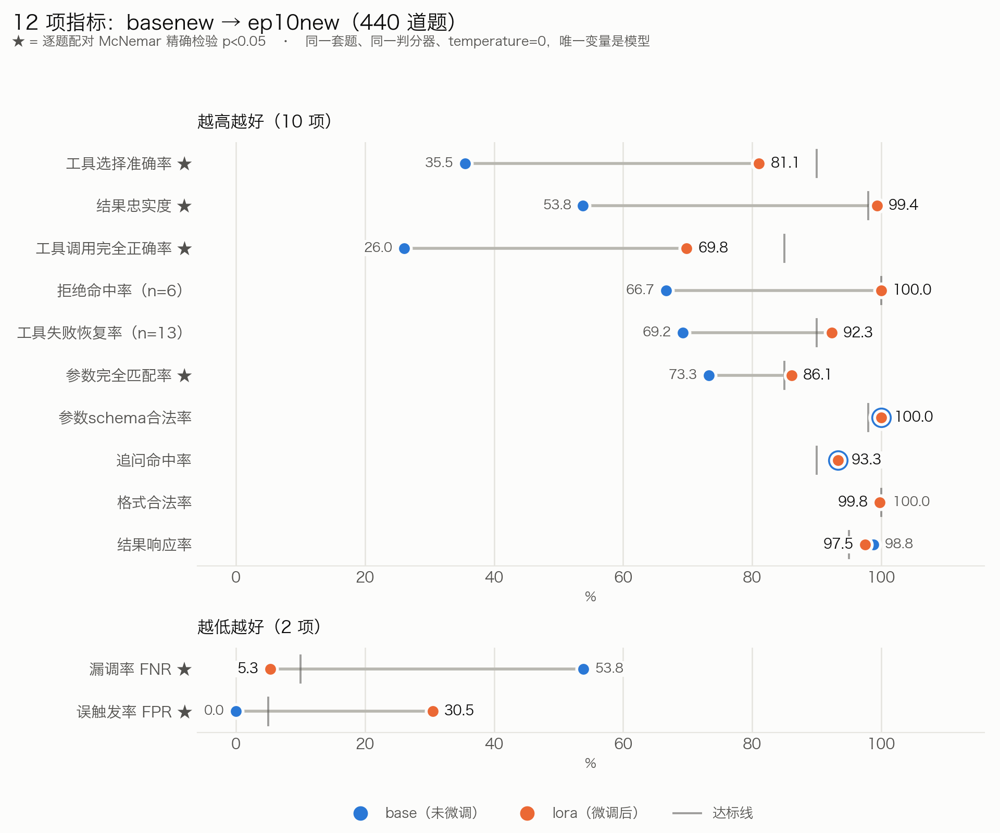
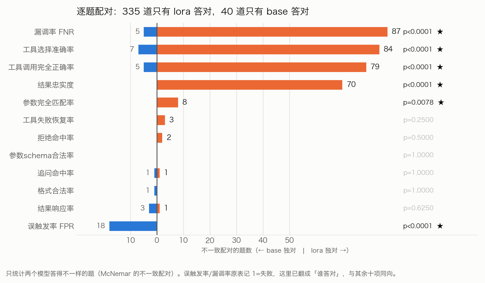
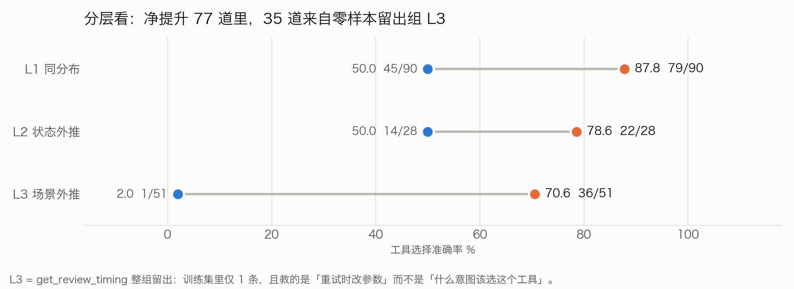

# 星知智链（ESA）技术报告

## 面向一流学科建设的计算机学科垂类大模型与创新应用开发

**报告版本：** V2.4
**报告日期：** 2026 年 9 月 8 日
**代码基线：** `main@c485941`
**项目名称：** 星知智链（Efficient Study Agent，ESA）

> 本报告对应赛题提交材料“05—作品代码”中的技术报告，重点说明代码实现、模型适配、评测方法和复现步骤。“06—效果验证报告”应另行提交真实目标用户反馈、结构化试用记录和 3 分钟以内的系统交互演示视频。

<!-- pagebreak -->

## 摘要

星知智链（ESA）是面向计算机学科建设的可信教学研智能体平台。项目不是将通用大模型简单包装为聊天界面，而是以课程知识图谱、学习证据、可追溯检索和受控工具调用为底座，把学生个性化学习、教师作业诊断与科研项目辅助连接成可验证闭环。系统采用 Flutter 多端前端、FastAPI 后端、Qwen3.5 主辅模型、vLLM 推理、LoRA 参数高效微调、DocIR 文档中间表示、Qdrant 向量检索和 SQLite 业务持久化；通过 Workspace、角色、资源绑定、能力目录、人工审批和只追加审计限制智能体的访问与写入边界。

针对 Agent “是否调用工具、选择何种工具、参数是否正确、能否忠实使用工具结果”等核心能力，项目建立了从真实工具 Schema 到中间表示、程序化生成、人工复核、泄漏检查、训练渲染和配对评测的完整数据流水线。定版 LoRA 在 440 道固定主考卷上，相比同基座模型显著提升工具选择准确率、完整调用正确率、结果忠实度、漏调率和参数完全匹配率；其中工具选择准确率由 35.5% 提升至 81.1%，结果忠实度由 53.8% 提升至 99.4%。同时，微调使误触发率由 0.0% 上升至 30.5%，说明模型由“过度保守”转为“积极调用”。项目进一步验证了推理期工具调用闸门，可将误触发率压至 8.5%，但尚未达到不高于 5% 的目标，因此仅作为待集成的缓解组件，不宣称问题已解决。

截至 2026 年 9 月 8 日，当前 Python 3.13 工作机的 Ruff、mypy 与后端全量测试均通过，pytest 结果为 `718 passed, 70 skipped, 3 warnings`。2026 年 9 月 5 日曾在当时工具链上通过 222 项非视觉 Flutter 测试、`flutter analyze` 和 Flutter Web release 构建；当前工作机没有 Flutter SDK，因此不把该历史结果表述为本轮重跑。来源对齐知识库 V1 已覆盖 16 门课程、215 个知识点、186 条前置关系，并建立 16 个知识源登记、48 条标准答案和 430 条检索标注。2026 年 9 月 8 日已验证公网首页与 HTTP 健康检查可访问，但真实模型、SSE、邮件、Qdrant、MinerU、代码沙箱和完整双角色流程仍需在比赛目标环境验收。本报告对已实现能力、可选能力和未完成事项分别标注，保证技术陈述可核验、可复现。

**关键词：** 学科垂类大模型；教育智能体；LoRA；工具调用；课程知识图谱；Student Model；RAG；教师复核；可复现评测

## 技术闭环与证据总览

### 核心结论

ESA 已形成“自然语言任务理解—受控工具决策—学科知识/学情/专业工具取证—可追溯输出—人工复核或用户确认—学习证据沉淀”的技术闭环。当前最强证据是固定考卷上的配对模型评测、真实逐题输出、来源登记完备的知识资产和自动化工程测试；最主要的未完成项是目标环境端到端验收、至少 2 名真实用户效果记录以及 3 分钟以内真实交互视频。

```text
学生 / 教师 / 科研用户的自然语言任务
→ 多轮上下文、当前 Workspace 与资源绑定
→ ScopedToolView 只暴露本轮被授权能力
→ LoRA 模型决定直答、追问、拒绝或工具调用
→ 知识库 / 知识图谱 / Student Model / 确定性工具返回证据
→ 模型依据证据生成并显示“AI 生成”标识
→ 高风险结果由教师复核或用户审批
→ 正式结果写入学习证据、业务状态与只追加审计
```

### 可核验资产规模

| 资产口径 | 当前规模 | 口径说明与证据 |
|---|---:|---|
| 来源对齐知识库 V1 | 16 门课程、215 个知识点、186 条前置关系 | 面向可授权语料与标准答案的提交口径；`data/knowledge_base/v1/` |
| 完整运行时课程图谱 | 47 门课程、479 个知识点、448 条前置关系 | 产品能力目录口径，范围大于知识库 V1；`backend/agent/memories/data/knowledge_graph/` |
| 知识源治理 | 16 个登记源：12 个随包开放源、3 个动态开放源、1 个仅参考源 | `source_registry.jsonl` 记录来源、许可证、获取日期及可用时哈希 |
| 内容质量基准 | 48 条标准答案、430 条检索标注、645 道题库、215 张概念卡 | 分别对应答案核验、检索核验、练习与知识点元数据 |
| 微调数据 | 1,421 条 IR；其中 1,094 条进入候选训练池 | 按模板冻结评测后，训练池再切分为 1,003 / 43 / 48 |
| Agent 评测 | 22 个工具；440 道主考卷；55 道补充集 | 主考卷哈希 `d441611fb5556b53`；补充集哈希 `46d55cde4d703fe6` |
| 人工裁定 | 264 条拒绝裁定 | `backend/scripts/dataset/data/eval/refusal_adjudication.json` 的 `verdicts` 字段 |
| 工程验证 | 本轮后端 `718 passed, 70 skipped`，Ruff/mypy 通过；前端保留 2026-09-05 历史验证记录 | `COMPETITION_AUDIT.md`；当前工作机未重跑 Flutter，不等同于目标环境验收 |

### 目标—结果—证据矩阵

| 技术目标 | 可核验结果 | 主要证据路径 | 状态 |
|---|---|---|---|
| 提升 Agent 工具决策 | 工具选择 35.5%→81.1%；完整调用 26.0%→69.8% | `backend/scripts/dataset/docs/06-效果验证材料.md`、图 1/3 | 已实现并有仓库证据 |
| 降低漏调并忠实使用结果 | FNR 53.8%→5.3%；结果忠实度 53.8%→99.4% | 同一 440 道考卷的配对结果 | 已实现并有仓库证据 |
| 抑制误触发 | 原始 LoRA FPR 30.5%；实验闸门降至 8.5% | `backend/scripts/dataset/steer/` | 已验证缓解，未达到 5% 目标且未接入默认路径 |
| 建立结构化权威知识 | V1 形成来源登记、标准答案、检索标注和概念卡 | `data/knowledge_base/v1/` | 仓库证据完整；目标环境 RAG 验收待补 |
| 实现个性化学习闭环 | 学习证据驱动掌握度、保持率、前置薄弱点和练习推荐 | `backend/agent/learning/`、第 8 章真实案例 | 已实现并有仓库证据 |
| 控制教学与科研风险 | AI 建议、教师裁决、资源作用域、审批、审计和沙箱 fail-closed | `backend/core/`、`backend/agent/tools/`、`backend/sandbox/` | 已实现；公网仅完成首页与 HTTP 健康检查，外部依赖和完整流程待验收 |

> 状态说明：“已实现并有仓库证据”表示代码、数据或测试可以在当前仓库核查；“目标环境验收待补”表示代码已存在，但比赛部署所需的真实模型、外部服务、数据索引或网络环境尚未完成现场验收；“其他提交材料待补”表示不能由本技术报告替代，必须另行提供签字文件、用户记录、体验地址或视频。

<!-- pagebreak -->

## 1. 赛题要求与报告定位

### 1.1 赛题交付要求

赛题文件要求“05—作品代码”包含作品代码、模型文件或模型文件 ServiceID、技术报告等材料，并确保可复现；“06—效果验证报告”则要求至少 2 名真实目标用户的试用反馈或结构化测试记录，并提交 3 分钟以内的应用系统交互演示视频。两份材料作用不同：本报告回答“系统如何实现、如何复现、技术结论是否可信”，效果验证报告回答“真实用户是否认可、实际使用是否有效”。

### 1.2 基础功能 1—4 逐项符合性

赛题第 6 页明确要求创新应用至少满足第 1—4 项基础功能点。ESA 的对应关系如下；其中“满足”仅针对当前仓库可证明的设计和实现，不替代比赛目标环境与真实用户验收。

| 赛题基础功能 | ESA 对应实现 | 核验证据 | 符合性判断 |
|---|---|---|---|
| 1. 深度贴合场景需求 | 学生个性化学习、教师作业分析—复核—发布、科研项目辅助三类 Workspace；生成内容受课程知识点和业务状态约束 | 第 2、5 章；`TEACHING_STUDENT_DEMO.md` | 满足，目标环境全流程待验收 |
| 2. 交互自然流畅 | 自然语言任务、会话历史、缺参追问、参数更正、错误恢复；多轮更正案例能够以最新课程和考试时间调用工具 | 第 7、8 章；评测项“追问命中率 93.3%” | 满足并有真实逐题评测证据 |
| 3. 知识权威可信 | 结构化课程—知识点—前置关系；16 个来源登记；12 个可随包开放源；48 条标准答案与 430 条检索标注 | 第 4.5 章；`data/knowledge_base/v1/` | 基础满足，动态时效性和真实 RAG 准确率待验收 |
| 4. 内容可追溯 | Evidence 保存文档、版本、章节、页码/定位器、片段和引用资格；标准答案通过 `source_refs` 关联来源登记 | 第 4.4、4.5 章；`backend/agent/rag/` | 机制满足，权威信息端到端展示待目标环境核验 |

此外，ESA 对第 5 项“可复制推广”、第 7 项“复杂问题求解”和第 8 项“个性化与自适应”也有明确实现，分别由学科知识包、复杂工作流和 Student Model/练习推荐支撑，见第 5、13 章。

### 1.3 七项评审维度对应关系

| 评审维度 | ESA 的技术证据 | 本报告位置 |
|---|---|---|
| 作品完成度（10 分） | 学习、教学、科研三类 Workspace；教师—学生作业闭环；前后端自动化测试与 Web 构建 | 第 3、5、9 章 |
| 创意实用度（20 分） | 将课程知识依赖、学生掌握度、教师复核和科研证据边界连接为同一智能体平台 | 第 2、5 章 |
| 技术实现度（20 分） | Qwen3.5/vLLM/LoRA、知识图谱、DocIR/RAG、22 工具训练快照、复杂工作流与审计 | 第 3、4、6 章 |
| 技术先进性（10 分） | 参数高效微调、三级泛化评测、配对显著性检验、隐状态工具调用闸门 | 第 6、7 章 |
| 内容质量度（20 分） | 来源定位、工具结果忠实度、人工拒绝裁定、教师最终裁决、典型技术案例 | 第 4、7、8 章 |
| 商业化潜力（10 分） | 学科知识包、Workspace 和工具能力可配置，可从计算机学院向同类专业复制 | 第 11 章 |
| 用户认可度（10 分） | 技术报告提供结构化评测；真实用户反馈与演示视频由“06—效果验证报告”承载 | 第 7、12 章 |

### 1.4 七类提交材料边界

| 提交材料 | 本项目当前状态 | 本报告中的处理原则 |
|---|---|---|
| `01—参赛信息` | 需使用报名系统审核通过且盖章的报名表 | 由团队线下准备，本报告不代替 |
| `02—伦理与安全合规性声明` | 系统已有“AI 生成”标识和数据/学术诚信控制；仍需负责人签字或团队盖章 PDF | 第 9 章提供技术事实，不代替正式承诺文件 |
| `03—作品Demo` | 公网地址与使用说明已整理，首页和 HTTP 健康检查已验证 | 临时双角色账号及模型、SSE、邮件等完整流程仍须目标环境验收 |
| `04—作品方案` | 已有主 PPT，包含方案、技术、效果与迭代 | PPT 独立提交且控制在 100 MB 以内 |
| `05—作品代码` | 代码与本技术报告已具备 | 仍必须补 LoRA 文件或 ServiceID，并验证干净环境复现 |
| `06—效果验证报告` | 模型评测报告、典型问题记录表、用户确认表和视频脚本已完成 | 必须由至少 2 名真实目标用户本人确认，并按脚本录制 3 分钟以内真实交互视频 |
| `07—其他材料` | 可提供测试脚本、评测原始结果、裁定表、质量审查和规模化数据 | 建议归档本报告所列证据，避免只提交汇总图 |

### 1.5 提交日期冲突提示

赛题原文存在需要主办方确认的日期冲突：第 9 页写“2026 年 9 月 15 日前，各参赛团队提交作品”，第 10 页“作品提交方式”写“于 2026 年 9 月 5 日前”发送至发榜单位邮箱。报告日期为 2026 年 9 月 8 日，后一个日期已经过去、前一个日期尚未到达。团队不应自行选择其中一个解释，应立即通过赛事答疑群或发榜单位确认有效截止时间并保留回复记录。

## 2. 项目背景、问题与目标

计算机学科具有明确的知识依赖和高频实践特征。例如，指针理解影响链表学习，图论基础影响最短路径与网络流，流水线结构影响数据冒险分析。通用大模型虽然能够回答知识问题，但很难持续知道某位学生是否真正掌握、回答依据来自哪里、是否可以访问某个班级或科研项目，以及一次模型建议是否有资格改变成绩或学习档案。

ESA 聚焦三个真实痛点：

- **助学：** 通用回答脱离学生基础，错因和练习结果难以沉淀为下一步学习行动。
- **助教：** 开放题批改和班级学情分析重复度高，但最终评分责任不能交给模型。
- **助研：** 文献检索、资料整理、数据分析与写作需要统一工作区，同时必须避免伪造来源、实验数据和研究结论。

项目目标是构建“可信证据驱动的教学研闭环”：模型负责理解意图、组织信息和提出建议；知识图谱、检索系统和专业工具提供可核验依据；教师或用户对高风险写操作保持最终控制；每一次正式学习证据都能够回到个人掌握状态和后续行动。

## 3. 系统总体架构

### 3.1 分层架构

```text
Flutter Web / macOS / iOS
        │  HTTPS + JSON + SSE
        ▼
FastAPI API 与认证层
        │
        ├─ Workspace / Role / Resource 授权
        ├─ Agent Loop、上下文编排、Tool/Skill 目录
        ├─ 学习状态、教学工作流、科研工作流
        ├─ DocIR / RAG / 个人知识库 / 附件解析
        └─ SQLite 持久化、审计与运行指标
        │
        ├─ Qwen3.5-122B-A10B + ESA LoRA（主模型）
        ├─ Qwen3.5-9B（辅助模型）
        ├─ Qwen3-Embedding-4B + Qdrant
        ├─ MinerU 文档解析服务
        └─ You.com MCP / arXiv / 数学工具 / 受控沙箱
```

### 3.2 主要技术组件

| 层次 | 实现 | 主要职责 |
|---|---|---|
| 客户端 | Flutter | 学习、教学、科研三类工作区，多端统一交互 |
| API | FastAPI | 认证、资源路由、业务接口、SSE 流式输出、错误边界 |
| 模型推理 | Qwen3.5 + vLLM 0.24.0 | 多轮理解、工具决策、结构化输出和生成 |
| 模型适配 | LLaMA-Factory + LoRA | 学科教学表达与 Agent 行为适配 |
| 学习智能 | 课程知识图谱 + Student Model V2 | 知识点解析、掌握度、证据置信度、保持率和复习时机 |
| 检索 | DocIR + Qwen3-Embedding-4B + Qdrant | 文档解析、版本化切块、稠密召回、来源定位 |
| 工作流 | TeachingStore / ResearchWorkflowFacade | 教师复核闭环、前沿追踪、写作和数据分析任务 |
| 治理 | Workspace + ScopedToolView + 审计 | 最小能力暴露、资源绑定、审批、幂等和追踪 |

### 3.3 运行时边界

系统对“模型能看到什么”和“模型能执行什么”分别控制。前者由可信上下文、Workspace 提示词、检索证据和资源快照构成；后者由 Tool Catalog、作用域、资源能力、审批模式和执行器共同决定。学习空间、教学空间和科研空间拥有不同工具视图，工具不会因为模型在文本中声称“获得授权”而被自动开放。

## 4. 核心技术实现

### 4.1 Qwen3.5 双模型与 LoRA 适配

主模型配置为 `Qwen/Qwen3.5-122B-A10B`，承担对话和 Agent 决策；辅助模型配置为 `Qwen/Qwen3.5-9B`，用于课表智能导入、后台对话压缩和教学分析等受限任务。主模型通过 vLLM 提供推理服务，并允许加载与基座匹配的单个 LoRA 适配器。

定版适配器为 `adapter_93728_nothink_ep10_20260903_1832`，LoRA rank 为 16，训练 10 个 epoch，评测时 `enable_thinking=false`。模型权重未纳入 Git 仓库；正式提交“05—作品代码”时必须同时提供适配器文件或可访问的模型 ServiceID，并记录基座模型、训练框架、配置和校验信息。

### 4.2 受控 Agent Runtime

Agent Loop 设置迭代次数、工具调用次数、工具重试、单工具超时和总墙钟时间预算。工具目录记录能力所属范围、只读性、幂等性、资源要求、审批模式和可重试错误。运行时按用户角色、Workspace、当前绑定资源和会话策略编译 `ScopedToolView`，仅将本轮允许的 Schema 暴露给模型。

学习数据集冻结了 22 个学习/公共工具 Schema，涵盖数学计算、位运算、Web/arXiv 检索、知识库检索、核心记忆、掌握度、学习证据、复习建议、Skill 加载和沙箱执行。科研动作 `start_frontier_tracking`、`start_research_writing`、`start_dataset_analysis` 采用“提出动作—校验资源—用户审批—执行”的路径，不包含在 22 工具学习快照中；教学上下文和附件解析工具也根据资源按轮动态注入。

### 4.3 课程知识图谱与 Student Model V2

知识底座以课程、知识点、前置关系、问题、来源和文档映射组成。当前仓库存在两个用途不同、不能混报的规模口径：`data/knowledge_base/v1/` 是面向合法知识源、标准答案和检索评测的来源对齐版本，包含 16 门课程、215 个知识点和 186 条前置关系；`backend/agent/memories/data/knowledge_graph/` 是产品运行时的完整课程能力目录，包含 47 门课程、479 个知识点和 448 条前置关系。前者用于本报告的知识可信与可追溯口径，后者用于说明系统可覆盖的课程图谱范围。

自然语言知识点在写入学习状态前必须解析到已知知识点 ID，无法解析时拒绝写入，避免模型自造知识点污染学生档案。课程图谱覆盖程序设计、数据结构与算法、计算机系统、操作系统、网络、数据库、编译原理、软件工程和人工智能等方向，并以显式前置关系支持薄弱根因定位。

Student Model V2 将长期掌握度与随时间变化的保持率分离：掌握度只由可评价的学习证据更新，保持率依据最后练习时间和稳定性动态计算，但不会随时间流逝反向改写掌握度。证据信号综合正误、回忆、解释、迁移、自信、提示级别、尝试次数、独立性和证据可靠性；幂等键防止同一行为重试时重复计入。未知知识点保持 `unseen`，不会被误报为“薄弱”。

### 4.4 DocIR、RAG 与多模态附件

PDF、Word、PPT、Excel 和图片可经 MinerU 与格式解析器转为 DocIR，再构建版本化 ChunkCollection。检索基线采用 `Qwen/Qwen3-Embedding-4B`，向量维度 2560，Qdrant 保存向量和租户范围元数据。默认流程为 Dense 召回 100 条、受控预选/重排最多 50 条、最终返回最多 5 条；重排器默认关闭，只有在受控实验验证后才启用。

检索结果同时维护三种投影：模型可见内容、用户展示内容和审计元数据。证据对象保存文档、版本、解析修订、章节、页码/定位器、原文片段和是否允许逐字引用等字段。公共知识库与个人知识库可以在可信上下文选择后并行检索，再以来源内排名融合；模型不能通过提示词扩大个人知识库范围。

RAG 和多模态能力在 `.env.example` 中默认关闭，原因是目标语料、索引清单和模型上下文契约必须先在比赛环境验证。技术报告将其列为已实现、可配置的模块，而不把“代码存在”等同于“目标环境已完成验收”。

### 4.5 知识源登记、标准答案与许可边界

来源对齐知识库 V1 建立了独立的 `source_registry.jsonl`。16 个登记源中，12 个为可随提交包提供的开放许可材料，3 个为运行时动态访问的开放来源，1 个为仅供参考且不可随包分发的非商业来源。登记项记录 `doc_id`、题名、作者、课程覆盖、来源页、许可证、获取日期、可用性等级；随包文件同时记录文件名、字节数、页数和 SHA-256，以便确认索引所用文档未被替换。

知识内容的核验资产分为三层：`gold_answer.jsonl` 提供 48 个典型问题、参考答案、必须覆盖知识点与 `source_refs`；`gold_retrieval.jsonl` 提供 430 个查询及期望课程、知识点和来源；`question_bank.jsonl` 提供 645 道带评分量表、难度、提示和证据默认值的练习。215 张概念卡只保存知识点元数据、学习目标和检索查询，不被当作可直接引用的事实正文；最终回答必须使用 DocIR/RAG 返回的 Evidence。

正式提交和演示只允许引用 `source_registry.jsonl` 登记且许可证允许当前用途的材料。`data/source_pdfs/` 中未登记、权属不清或文件名含第三方非授权分发标记的本地资料不得打包、不得建入比赛知识库、不得作为“权威来源”佐证。动态来源在演示时还应记录访问时间和内容版本；仅参考源如需进入可分发语料，必须先完成单独许可审查。

### 4.6 代码执行与外部工具

数值计算、符号计算和位运算使用确定性工具完成，减少模型在精确计算上的自由生成。Web 搜索通过生命周期受控的 You.com MCP 子进程，仅暴露允许的搜索工具；arXiv 返回结构化论文结果。代码执行使用 Bubblewrap 隔离、独立用户/对话工作目录、CPU/内存/文件/进程/输出/超时限制和默认断网策略。沙箱默认关闭；缺少 Bubblewrap 或安装器时必须 fail-closed，不允许退化为在宿主机直接执行模型生成命令。

## 5. 教学研应用闭环

### 5.1 助学闭环

学生提出问题或完成练习后，系统将问题映射到课程知识点，结合真实掌握度、前置状态、提示历史和复习时机调整讲解或推荐练习。只有发生真实且可评价的学习表现时，`record_learning_evidence` 才能写入证据；泛泛对话、自我陈述或模型猜测不得直接改变掌握度。

### 5.2 助教闭环

已实现的纵向流程如下：

```text
教师创建班级并邀请学生
→ 教师创建、发布简答题或代码文本题作业
→ 学生提交答案
→ AI 生成受约束的结构化分析建议
→ 教师逐题复核得分、错因、评语和知识点
→ 教师主动发布反馈
→ 正式反馈写入学习证据和个人掌握度
→ 班级看板聚合薄弱知识点、前置根因和关注学生
```

AI 不会自动发布成绩，也不会在教师确认前更新学生掌握度。学生只能读取自己的提交和已发布反馈；教师只能读取本人班级形成的教学证据，不能访问学生私人对话、记忆、科研项目或无关附件。辅助模型不可用或输出无效时，系统返回低置信度确定性降级结果并要求人工复核。

### 5.3 助研闭环

科研空间以项目为授权边界，支持前沿追踪、科研写作和数据集分析任务。启动动作前会重新校验项目、文档或数据集是否仍属于当前用户和当前绑定项目。写作任务仅使用用户已提供材料；证据不足时应标记待补来源，不得生成虚构作者、题名、DOI、实验数据或研究结论。

## 6. 数据集与训练工程

### 6.1 数据流水线

项目采用“Schema—种子—生成器—IR—校验—评测切分—训练渲染”的流水线：

```text
后端真实 Tool Schema
→ 人工场景种子与程序化生成器
→ 与模型格式解耦的 IR
→ 真实工具结果/受控 fixture
→ 20+ 项静态与语义校验
→ 按 template_id 整组切分并执行零泄漏断言
→ ShareGPT / Qwen3.5 工具调用格式
→ LLaMA-Factory LoRA 训练
```

生成器不会直接写训练格式。IR 记录用户状态、期望动作、工具名、参数、观测值和最终回答等语义事实，渲染器再转换为目标模板，降低后端格式变化造成的数据报废风险。计算器观测值来自后端真实函数缓存；学习状态工具 fixture 对齐后端公式和字段；每次工具 Schema 变化后重新捕获并计算版本指纹。

### 6.2 数据规模与构成

| 项目 | 数量/标识 |
|---|---|
| IR 样本总数 | 1,421 条 |
| 学习空间工具 | 22 个 |
| Schema 版本 | `711faf60` |
| 冻结评测后候选训练池 | 1,094 条，另有 1 条因待人工复核被拦截 |
| 候选训练池的训练/验证/测试切分 | 1,003 / 43 / 48 |
| 主评测模板 | 277 个，渲染为 440 道问题 |
| 补充评测模板 | 49 个，渲染为 55 道问题 |
| 主考卷哈希 | `d441611fb5556b53` |
| 补充集哈希 | `46d55cde4d703fe6` |

数据覆盖普通直答、单/多轮工具调用、难负例、参数缺失追问、工具错误恢复、拒绝、知识检索、Skill 和学习状态工具。负样本用于抑制“逢问必调工具”，错误恢复样本要求模型根据结构化错误采取追问、改参、换工具或解释降级，而不是伪造成功结果。

### 6.3 防泄漏与三级泛化

切分以 `template_id` 为单位整组进行，`split.assert_no_leak` 强制训练池与考卷模板交集为零。主评测按 277 个模板分为：L1 同分布 156、L2 状态外推 70、L3 场景外推 51。L3 将 `get_review_timing` 整组作为未见工具场景：训练池中没有该工具的正向调用样本；仅存在 1 条“工具失败后重试参数”的恢复语境，不能为“何时选择该工具”提供正样本。因此 L3 结果用于衡量从 Schema、工具命名和相邻能力迁移出的场景外推，而不是训练记忆。

## 7. 模型效果评测

### 7.1 评测设计

base 与 LoRA 使用同一套题、同一判分器、相同后端基准、`temperature=0`，唯一变量为模型。两个模型逐题配对，使用 McNemar 精确检验判断差异；不以独立样本比例检验替代配对设计。拒绝项不采用关键词子串作为最终判据，而由人工阅读完整回答后按冻结标准裁定。裁定表共 264 条，其中 2026 年 9 月 5 日定版与 DPO 批次为盲判，2026 年 9 月 6 日补充的 base 批次因只有单一模型而非盲判，本报告如实披露。

### 7.2 十二项主结果

定版模型在 12 项指标中达到 8 项预设门槛。主考卷结果如下：

| 指标 | base | LoRA 定版 | 变化与判断 |
|---|---:|---:|---|
| 格式合法率 | 100.0% | 99.8%（439/440） | 差 1 道未达 100% 门槛 |
| 工具选择准确率 | 35.5% | 81.1%（137/169） | 显著提升，`p<0.0001` |
| 工具调用完全正确率 | 26.0% | 69.8%（118/169） | 显著提升，`p<0.0001` |
| 误触发率 FPR | 0.0% | 30.5%（18/59） | 显著退化，`p<0.0001` |
| 漏调率 FNR | 53.8% | 5.3%（9/169） | 显著改善，`p<0.0001` |
| 参数完全匹配率 | 73.3% | 86.1%（118/137） | 显著提升，`p=0.0078` |
| 参数 Schema 合法率 | 100.0% | 100.0%（137/137） | 达标 |
| 追问命中率 | 93.3% | 93.3%（28/30） | 达标，无净变化 |
| 工具失败恢复率 | 69.2% | 92.3%（12/13） | 方向改善，小样本 `p=0.25` |
| 结果响应率 | 98.8% | 97.5%（159/163） | 达标，`p=0.625` |
| 结果忠实度 | 53.8% | 99.4%（155/156） | 显著提升，`p<0.0001` |
| 拒绝命中率 | 66.7% | 100.0%（6/6） | 方向改善，小样本 `p=0.5` |



逐题配对中，335 道仅 LoRA 答对，40 道仅 base 答对。工具选择、完整调用、结果忠实度、漏调率和参数完全匹配率达到统计显著；拒绝与错误恢复因分母较小，只报告方向，不写成显著提升。



### 7.3 分层泛化结果

在工具选择分层结果中，LoRA 在 L1、L2、L3 上分别为 87.8%（79/90）、78.6%（22/28）和 70.6%（36/51）；base 分别为 50.0%、50.0% 和 2.0%。L3 的大幅提升说明模型不仅记忆训练模板，也能对未见工具场景进行一定迁移，但 70.6% 仍不足以支持“完全具备场景外推能力”的表述。



### 7.4 误触发与漏调的真实权衡

base 的 FPR 为 0.0%，但其 FNR 高达 53.8%，即 169 道应调用题中漏掉 91 道。它并非准确识别了“不该调用”，而是整体过度保守。LoRA 将 FNR 降至 5.3%，同时使 FPR 升至 30.5%，说明微调把模型推向更积极的工具使用策略。这是必须公开的行为权衡，不能只展示工具选择提升而忽略误触发。

### 7.5 推理期工具调用闸门

`backend/scripts/dataset/steer/` 提供经过离线与端到端评测的可选闸门：在残差流第 48 层读取模型生成第一个 token 前的最后 token 隐状态，与 3072 维方向做点积，低于阈值时抑制工具调用。方向由当前适配器表示的差值均值构造，不需要额外训练，主考卷区分 AUROC 为 0.959。

默认阈值的端到端重跑将 FPR 从 30.5% 降至 8.5%（5/59），工具选择下降 1.2 个百分点，完整调用下降 0.6 个百分点，FNR 在该闸门重跑口径中由 5.9% 上升至 8.3%，仍处于不高于 10% 的目标内。FPR 8.5% 仍未达到不高于 5% 的门槛，因此本组件只能描述为“显著缓解误触发”，不能描述为“解决误触发”。

该闸门需要直接访问 `output_hidden_states`，OpenAI 兼容 API 层无法提供；方向与适配器绑定，换模型、继续训练或进行 DPO 后必须重新导出。当前仓库包含算法、方向文件接口、适配器一致性检查和测试，但尚未接入默认线上推理路径。

### 7.6 阴性实验与停止准则

| 实验轴 | 做法 | 结果 | 决策 |
|---|---|---|---|
| 训练时长 | epoch 3→5→10 | 工具选择、完整调用、FNR 变差；忠实度、拒绝、恢复变好 | 采用 epoch 10，承认多目标权衡 |
| 目标函数 | 两版 DPO，第二版 224 对两侧平衡 | FPR 降至 16.9%，但恢复率由 92.3% 降至 69.2%，12 项无显著净增益 | 不采用 |
| LoRA 容量 | 可训练参数 32.7M→42.1M（+28.9%） | 30.5% 问题输出改变，但 12 项净效应为零 | 不采用扩容方案 |

这些结果说明当前主要瓶颈不是简单增加训练时长、目标函数或参数容量，而在更精确的难负例、更多 L2/L3 数据、推理期决策边界和任务定义。报告保留阴性结论，以避免只汇报有利实验造成选择性偏差。

## 8. 典型技术测试案例

本章的前三个案例直接取自定版 LoRA 作业 `95348` 的 440 道固定主考卷，不以单元测试输出代替模型输出。原始输入和工具观测来自 `backend/scripts/dataset/data/eval/eval.jsonl`，模型逐题输出来自 `pred_nothink_ep10_95348.jsonl`，逐项判分来自 `report_nothink_ep10_95348.json`。为避免泄露模型内部思考，仅展示用户输入、工具调用、工具观测摘要和最终可见回答。

### 8.1 案例一：精确计算与结果忠实度

**评测 ID：** `calc_000_0`（L1 同分布）
**用户输入：** “算一下 `sqrt(144) + 2^5`。”

**定版模型工具调用：**

```json
{"name":"calculator","arguments":{"expression":"sqrt(144) + 2^5"}}
```

**确定性工具观测：** `{"expression":"sqrt(144) + 2^5","result":44}`
**模型最终输出：** “结果是 44。”

**准确性论证：** `sqrt(144)=12`，`2^5=32`，标准答案为 `12+32=44`。模型选择了正确工具，参数与冻结标准完全一致，最终回答与工具返回值一致。该题在格式合法、工具选择、完整调用、参数完全匹配、参数 Schema、结果响应和结果忠实度七项逐题判分中全部通过。

**实现证据：** `backend/agent/tools/math_tools/calculator.py`、`backend/scripts/dataset/esa/tools_exec.py`。

### 8.2 案例二：多轮更正、歧义消解与个性化推荐

**评测 ID：** `s002_修改参数_0020`（L1 同分布）
**第一轮输入：** “我想复习计算机组成原理，期末考试还有 12 周。”
**第二轮更正：** “抱歉说错了，课程是操作系统，考试在 12 周后。”

**定版模型工具调用：**

```json
{"name":"recommend_practice","arguments":{"course":"操作系统","weeks_to_exam":12}}
```

**工具观测摘要：** 操作系统优先练习项依次包括设备管理（掌握度 15.98、优先级 0.5548）、页面置换算法（58.33、0.4193）和分页（22.83、0.3978）；设备管理还存在中断系统等 4 个掌握度低于 50 的前置知识点。

**模型最终输出：**

> 根据你在操作系统的学情，距考试 12 周，建议优先练设备管理、页面置换算法和分页。先从设备管理开始，掌握度只有 15.98，是当前最薄弱的一环；它的前置“中断系统”掌握度也只有 22.44，建议先补齐该前置。

**准确性论证：** 模型没有沿用首轮错误课程，而是以最新一轮的“操作系统、12 周”为准；工具名称和两个参数与冻结标准完全一致。最终输出使用的知识点顺序、掌握度、优先级和前置薄弱值均可在工具观测中逐项找到，没有自行编造学情。该题的调用与响应在格式、工具选择、完整调用、参数完全匹配、Schema、结果响应和忠实度逐题判分中全部通过，直接证明赛题要求的多轮上下文理解、歧义消解和个性化适配。

**实现证据：** `backend/agent/tools/learning/runtime.py`、`backend/agent/learning/knowledge_map_service.py`、`backend/agent/learning/student_model.py`。

### 8.3 案例三：学习证据写入与状态闭环

**评测 ID：** `record_learning_evidence_正例_practice_0012`（L1 同分布）
**用户输入：** “二叉树遍历这题我做对了。”

**定版模型工具调用：**

```json
{"name":"record_learning_evidence","arguments":{"kp_id":"二叉树遍历","activity_type":"practice","correct":true}}
```

**工具观测摘要：** `saved=true`、`duplicate=false`；掌握度由 44.71 更新为 58.03，变化 13.32；累计练习 11 次、正确 6 次，状态为 `learning`，当前 `needs_review=false`。

**模型最终输出：**

> 你的“二叉树遍历”掌握度已更新为 58.03，累计练习 11 次，其中做对了 6 次。这次练习让掌握度提升了 13.32 分，目前状态为“学习中”，暂时不需要安排复习。

**准确性论证：** 用户提供了知识点、练习行为和可判定正误，满足“真实且可评价的学习表现”写入门槛；模型没有添加用户未提供的自信度、提示次数或错误类型。工具参数与冻结标准完全一致，最终输出中的 58.03、11、6、13.32、`learning` 和不需复习均来自工具观测。该题在调用和响应的七项逐题判分中全部通过。服务端还通过唯一幂等键防止同一可信请求重试时重复计入。

**实现证据：** `backend/agent/learning/evidence_store.py`、`backend/agent/learning/learning_state_service.py`、`backend/agent/tools/learning/runtime.py`。

### 8.4 补充：知识内容标准答案与权威来源基线

为覆盖“知识权威可信”和“内容可追溯”，知识库 V1 另建了不依赖模型自由判断的标准答案集。例如 `AG-0029` 的问题为“产生死锁通常需要哪些经典必要条件？”，标准答案要求覆盖“互斥、占有且等待、不可剥夺、循环等待四个条件同时成立”，并通过 `source_refs` 关联开放教材 `Operating Systems and Middleware` 与 RISC-V Privileged Architecture 规范登记项。评测可按 `must_cover` 和语义评分量表判定回答是否存在关键遗漏或错误。

该基线证明仓库已经具备权威来源登记和标准答案对照能力，但本报告不把它冒充为已完成的线上 RAG 结果。比赛目标环境仍需从 `gold_answer.jsonl` 中抽取不少于 3 题进行真实检索—生成—来源展示验收，并把界面截图或录屏放入“06—效果验证报告”。

以上三个主案例满足赛题“至少 3 个典型问题、展示输出结果并进行准确性论证”的技术报告要求；它们仍不能代替“06—效果验证报告”中至少 2 名真实目标用户的身份、频次、时间、使用效果和 3 分钟以内真实交互视频。

## 9. 安全、伦理与数据治理

### 9.1 身份与资源隔离

- 注册角色固定为学生或教师；学生可进入学习、科研空间，教师额外拥有教学空间。
- 教师访问必须同时满足教师角色和班级所有权；学生访问必须满足有效班级成员关系。
- 无权访问与资源不存在统一返回 404，减少资源枚举；错误角色入口返回 403。
- 个人知识库的 Qdrant 点带有用户、知识库、可见性和内容角色范围，查询时强制附加过滤。

### 9.2 高风险写入与人机协同

- AI 教学分析只是建议，最终分数、错因、知识点和反馈由教师确认。
- 未发布 AI 结果不进入学生档案，正式反馈发布使用幂等记录防止重复写入。
- 推断出的长期记忆只生成候选，需用户确认后写入；敏感凭据禁止保存。
- 科研启动动作需要审批，执行前重新校验资源快照，避免授权后资源被移动或归档造成越权。

### 9.3 审计与最小披露

邀请、提交、分析、复核、反馈发布和受限详情访问写入只追加审计日志；工具结果分为模型、展示和审计通道，完整审计信息不会回流模型历史。邮件验证码只保存摘要，邮件服务令牌、验证码 Secret 和 Resend Key 分离存放，不写入仓库或日志。

### 9.4 内容与学术规范

RAG 命中携带来源定位和引用资格；无证据时不得伪造引用。科研写作不允许生成虚构作者、题名、DOI、实验数据或结论。拒绝评测覆盖个人数据、未脱敏数据、学术诚信和越权操作，并使用人工裁定纠正关键词法的假阳性与假阴性。

### 9.5 AI 标识、数据与知识产权边界

前端对非空助手回答统一显示“AI 生成”标识，代码位置为 `frontend/lib/widgets/assistant_message.dart`；教师复核界面同时显示“AI 建议”，并明确“AI 分析仅作为建议、教师复核形成最终裁决”。这为赛题要求的明显 AI 内容标识提供了仓库证据，但正式提交前仍需在目标环境逐页检查，确保聊天、教学分析、科研写作和导出内容不存在未标识入口。

比赛数据必须使用脱敏或合成身份。当前评测中的 `stu_demo` 和固定学习状态属于测试 fixture，不代表真实学生；真实用户试用材料在进入“06—效果验证报告”前应删除姓名、学号、邮箱、聊天记录和可识别截图信息。正式签字版“02—伦理与安全合规性声明”仍需单独承诺不使用未经脱敏的真实个人数据、不伪造学术数据或文献、设置明显 AI 生成标识。

知识产权方面，以 `data/knowledge_base/v1/source_registry.jsonl` 为唯一提交白名单。只有登记且许可证允许的材料可随包分发或进入比赛索引；本地未登记、权属不清或带非授权分发标记的 PDF 必须从提交压缩包、部署语料目录和演示证据中排除。依赖、模型、字体、图片和训练语料也应在最终包中附来源与许可证清单。

## 10. 工程质量与验证状态

截至 2026 年 9 月 8 日，仓库工程审查记录如下：

| 检查 | 结果 |
|---|---|
| Ruff | 全部通过 |
| mypy | 5 个纳入范围的源文件无问题 |
| 后端 pytest | 718 passed，70 skipped，3 warnings；45.04 s |
| Flutter 非视觉测试 | 2026-09-05 历史结果：222 passed；本轮未重跑 |
| Flutter analyze | 2026-09-05 历史结果：通过；本轮未重跑 |
| Flutter Web release | 2026-09-05 历史结果：构建成功；本轮未重跑 |
| 公网最小检查 | 2026-09-08 首页 HTTP 200；`/api/health` HTTP 200，响应 `{"status":"ok"}` |

70 个跳过项主要依赖 MinerU 多格式/PDF fixture、真实 RAG 语料、评测 artifacts 和 `clangd`。3 个警告来自 FastAPI/Starlette/httpx 弃用提示，不影响本轮测试结果，但应纳入依赖升级计划。当前工作机没有 Flutter SDK，因此没有形成新的前端测试、静态分析、视觉 golden 或 Web 构建结论。公网最小检查只证明站点和 HTTP 进程可访问，不证明真实模型、SSE、邮件、Qdrant、MinerU、沙箱或双角色流程已经通过。

## 11. 部署与可复现说明

### 11.1 推荐资源

参考 Slurm 部署申请 8 张 GPU：主模型使用 6 张（TP=2、PP=3），辅助模型 1 张，RAG/MinerU 1 张。主 API 默认端口 51024，辅助模型 51025，MinerU API 51026，Qdrant 6333。实际显存和并行配置应按目标硬件重新压测，不在登录节点直接加载模型。

### 11.2 环境安装

```bash
cd /path/to/esa
python -m pip install -r requirements.txt
python -m pip install -r requirements-dev.txt
cd frontend && flutter pub get && cd ..
```

DocIR/RAG 与 MinerU 建议使用隔离环境，具体版本、CUDA 注意事项和验证命令见 `RAG_DocIR_mm_env.md`。生产秘密应写入不受 Git 跟踪的私有配置或进程环境，禁止写入 `.env.example` 和源码。

### 11.3 关键配置

```bash
export ESA_MODEL_PATH=Qwen/Qwen3.5-122B-A10B
export ESA_MODEL_LORA_PATH=/absolute/path/to/adapter
export ESA_MODEL_LORA_NAME=esa-agent
export ESA_AUXILIARY_MODEL_PATH=Qwen/Qwen3.5-9B
export HOST=0.0.0.0
export PORT=51024
```

如启用 RAG，还需提供冻结的 collection manifest、index deployment manifest、Qdrant 地址、Embedding 模型和向量维度；如启用邮件、MCP 搜索或沙箱，分别配置独立服务凭据、`YDC_API_KEY` 和 Bubblewrap 前置条件。

### 11.4 启动与质量检查

```bash
# 启动完整后端栈
./backend/scripts/run_esa_stack.sh

# 或仅启动 FastAPI
uvicorn backend.core.web.webAPI:app --host 0.0.0.0 --port 51024

# 前端
cd frontend
flutter run --dart-define=ESA_API_BASE=http://127.0.0.1:51024/api

# 质量门禁
cd ..
make quality
```

### 11.5 数据与评测复现

```bash
cd backend/scripts/dataset

# 生成 IR（按需先捕获真实工具结果）
for g in calculators scenarios new_tools negatives external skills_rag tool_errors; do
  python3 generators/gen_${g}.py
done

# 校验、构建评测集、零泄漏切分与渲染
PYTHONPATH=. python3 -m esa.validate data/ir/*.jsonl
PYTHONPATH=. python3 -m esa.evalset
PYTHONPATH=. python3 -m esa.split data/eval/train_ir.jsonl

# 数据流水线自检
python3 tests/test_validator.py
python3 tests/test_fixture_contract.py
python3 tests/test_parser_compat.py
python3 tests/test_eval_scoring.py
python3 tests/test_review_ledger.py
```

评测必须固定考卷哈希、模型、LoRA、推理参数、判分器和后端基准。拒绝项评分必须带 `--adjudication data/eval/refusal_adjudication.json`。本技术报告交付目录的 `evidence/` 已归档 base 作业 `95431` 与定版 LoRA 作业 `95348` 的逐题预测和原始报告；仓库同时保留正式 PNG 图与裁定表。原始报告中的拒绝率仍是自动关键词口径，最终数字必须应用人工裁定，具体注意事项见 `evidence/README.md`。正式提交时还应归档评测命令、作业号、适配器校验值和完整运行日志。

### 11.6 复现交付清单

正式提交前，“05—作品代码”压缩包至少应包含：

- 当前代码仓库和本技术报告；
- `requirements.txt`、`requirements-dev.txt`、`.env.example` 和部署说明；
- LoRA 适配器文件，或可访问的模型 ServiceID 与加载说明；
- 22 工具 Schema 快照、数据集生成脚本、评测集哈希和人工裁定表；
- base/LoRA 原始逐题预测、报告 JSON 和三张正式评测图；
- 数据与第三方模型/语料的来源、许可证和脱敏说明；
- 一键或分步启动脚本，以及目标环境验收记录。

## 12. 已知限制与迭代计划

### 12.1 当前限制

- LoRA 主评测达到 8/12 项门槛；工具选择和完整调用仍未达到 90%/85% 目标。
- 微调后 FPR 为 30.5%；闸门可降至 8.5%，但仍未达到不高于 5%，且尚未集成默认推理路径。
- 拒绝和工具错误恢复样本量较小，只能报告方向，不能宣称统计显著。
- RAG 代码与配置完整，但比赛目标语料的端到端问答准确率、引用质量和真实 Qdrant 部署仍需验收。
- 沙箱默认关闭，只有安装 Bubblewrap、依赖安装器和资源限制工具后才能进行目标环境验收。
- 教学 Demo 当前支持简答题和代码文本题，不包括复杂客观题、附件题、运行结果评分、多教师协作和大班级预计算。
- 工程自动化通过不等于公网生产验收；HTTPS、Nginx SSE、邮件、模型、缓存更新和多浏览器仍需人工走查。
- 来源对齐知识库已有标准答案与来源登记，但目标环境的真实检索准确率、引用展示和权威信息可追溯案例仍需完成。
- 本地存在未进入来源登记白名单的资料文件，最终打包和部署前必须执行知识产权清理，避免误提交或误建索引。
- 用户认可度材料尚需在“06—效果验证报告”中补齐至少 2 名真实目标用户身份、使用频次、使用时间和具体场景效果。

### 12.2 优先迭代

1. 补充高混淆难负例和 L2/L3 场景，重点优化“仅提及信息”与“明确请求执行”的边界。
2. 将工具调用闸门接入可访问隐状态的推理层，建立适配器变化后自动失效与重新导出机制。
3. 使用比赛真实课程材料完成 RAG 索引冻结、引用准确性和典型问题端到端验证。
4. 在目标 GPU、Qdrant、MinerU、邮件和 Bubblewrap 环境完成双账号全流程与故障降级验收。
5. 组织真实教师和学生试用，将复核修改率、任务耗时、理解度和后续练习表现写入效果验证报告。

## 13. 可扩展性与应用前景

ESA 的扩展单元不是重新训练整个产品，而是可组合的学科知识包、知识图谱、工具 Schema、Skill、Workspace 策略和 LoRA 适配器。计算机学科内可以从核心课程扩展到网络安全、软件工程实践、数据科学与人工智能实验；跨学科迁移时，可替换课程图谱、权威语料、专业工具和教学证据规则，同时复用身份、工作流、检索、审计和评测基础设施。

面向院系部署，可逐步增加统一身份认证、课程平台对接、组织目录、助教角色、批量任务和聚合快照。商业化或规模化前必须先完成数据授权、模型/语料许可证、AI 内容标识、隐私影响评估和目标环境安全验收。

## 14. 结论

星知智链以计算机学科知识结构和真实教学研流程为中心，完成了从大模型对话到受控智能体的系统化实现。项目的主要技术贡献包括：可验证的教师—学生证据闭环；将知识图谱、Student Model 和 RAG 连接到个性化学习；按 Workspace、资源和审批控制 Agent 能力；建立与后端真实工具一致的数据集流水线；用固定考卷、人工裁定和配对检验量化 LoRA 的收益与代价。

评测证明 LoRA 显著改善了工具选择、完整调用、忠实使用结果和漏调问题，同时暴露了误触发退化。项目没有掩盖这一边界，而是以推理期闸门和阴性实验继续定位问题。结合已通过的工程质量门禁、明确的复现步骤和未完成事项声明，当前版本在仓库证据层面覆盖了赛题基础功能 1—4，并具备比赛技术核验基础；最终提交仍需配套模型文件或 ServiceID、真实环境验收、签字合规声明和独立的用户效果验证材料。

## 附录 A：关键代码与材料索引

| 路径 | 内容 |
|---|---|
| `README.md` | 项目入口、能力边界、启动与部署说明 |
| `API.md` | 前后端接口契约 |
| `TEACHING_STUDENT_DEMO.md` | 已实现教师—学生闭环与双账号脚本 |
| `COMPETITION_AUDIT.md` | 2026-09-08 工程质量与竞赛交付审查 |
| `RAG_DocIR_mm_env.md` | DocIR、RAG、MinerU 与多模态环境说明 |
| `backend/agent/learning/` | Student Model、学习证据和知识地图服务 |
| `backend/agent/rag/` | 检索契约、索引、融合和模型投影 |
| `backend/agent/tools/catalog.py` | 工具范围、资源要求和能力声明 |
| `backend/core/workflows/research/` | 科研工作流门面、动作校验与执行 |
| `backend/sandbox/sandbox.py` | Bubblewrap 隔离与资源限制 |
| `backend/scripts/dataset/` | 数据生成、校验、切分、训练渲染和评测 |
| `backend/scripts/dataset/docs/06-效果验证材料.md` | 正式数据口径、主表与阴性结论 |
| `backend/scripts/dataset/data/eval/refusal_adjudication.json` | 264 条拒绝人工裁定 |
| `backend/scripts/dataset/steer/` | 推理期工具调用闸门与复现实验 |
| `data/knowledge_base/v1/` | 来源对齐知识库、登记源、标准答案、检索标注与题库 |
| `deliverables/technical-report/evidence/` | base/LoRA 原始逐题预测、判分报告与口径说明 |
| `deliverables/technical-report/build_report.py` | 从 Markdown 重建正式 DOCX，并统一标题、表格、图片和页眉页脚样式 |
| `deliverables/technical-report/verify_report_claims.py` | 自动核验知识资产、数据划分、人工裁定、评测指纹和典型案例指标 |

## 附录 B：模型评测标识

| 项目 | 值 |
|---|---|
| 基座模型 | `Qwen/Qwen3.5-122B-A10B` |
| 定版 LoRA | `adapter_93728_nothink_ep10_20260903_1832` |
| LoRA rank | 16 |
| 训练 epoch | 10 |
| 主评测作业 | base `95431`；LoRA `95348` |
| 主考卷 | 440 题，`d441611fb5556b53` |
| 补充集 | 55 题，`46d55cde4d703fe6` |
| 工具 Schema | 22 个，版本 `711faf60` |
| 推理设置 | `temperature=0`，同判分器、同后端基准 |

## 附录 C：提交前核验表

- [ ] 代码包能在干净环境按本报告步骤安装并启动。
- [ ] LoRA 文件或 ServiceID 可访问，基座与适配器匹配。
- [ ] 未提交密钥、真实凭据、用户隐私数据、日志或数据库。
- [ ] 已签字或盖章提交“02—伦理与安全合规性声明”。
- [ ] 聊天、教学、科研和导出结果均有明显“AI 生成/AI 建议”标识。
- [ ] 提交语料只来自 `source_registry.jsonl` 白名单，未登记或权属不清 PDF 已排除。
- [ ] 3 个典型问题包含真实输出、标准答案/权威来源和准确性说明。
- [ ] 至少 2 名真实目标用户反馈标明身份、频次、时间和使用场景。
- [ ] 3 分钟以内视频展示从任务输入到结果输出的完整流程。
- [ ] 评测哈希、推理参数、人工裁定和原始报告可追溯。
- [ ] 在已验证首页与 HTTP 健康检查的基础上，继续完成 HTTPS 证书链、SSE、邮件、Qdrant、MinerU、沙箱和双角色流程验收。
- [ ] 数据、模型、语料、依赖和图片的许可证与知识产权说明完整。
